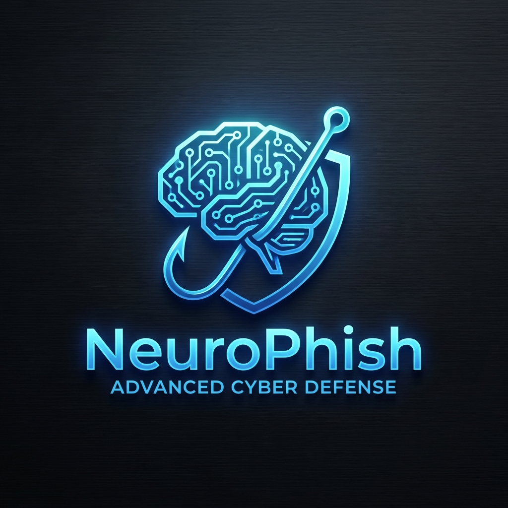

# NeuroPhish: Advanced Multi-Modal Phishing Detection System

<p align="center">
  
</p>

## 🚀 Overview

**NeuroPhish** is a state-of-the-art, AI-powered phishing detection ecosystem designed to provide comprehensive protection across multiple digital channels. By leveraging advanced Machine Learning (ML), Natural Language Processing (NLP), and Explainable AI (XAI), NeuroPhish identifies malicious attempts in URLs, emails, SMS, images (OCR), and audio (STT) with over 95% accuracy.

The system is built for both security analysts and end-users, providing real-time threat scoring and transparent explanations for every detection decision.

---

## ✨ Key Features

- **🛡️ Multi-Modal Detection**: Analyze threats across URLs, Emails, SMS, Images, and Audio.
- **🧠 Advanced AI Engine**: Powered by transformer-based NLP models and heuristic rule engines.
- **🔍 Explainable AI (XAI)**: SHAP-based visualizations to understand *why* a threat was flagged.
- **💊 Active Defense (Poison Pill)**: Automatically flood detected phishing sites with thousands of fake credentials to dilute stolen data and disrupt attacker operations.
- **🌐 Real-Time Protection**: Browser extension for instant warnings while surfing.
- **📊 Forensic Dashboard**: A sleek galaxy-themed dashboard for monitoring and investigating threats.
- **🔄 Simulation Mode**: Train users and organizations with controlled phishing simulation campaigns.
- **🔗 Blockchain Integration**: Immutable logging of threat intelligence and forensic reports.

---

## 🛠️ Tech Stack

### Backend
- **Framework**: FastAPI (Python)
- **Database**: PostgreSQL (Structured data), Redis (Caching)
- **AI/ML**: Scikit-learn, Transformers (HuggingFace), SHAP (Explainability), ONNX
- **Security**: JWT Authentication, Blockchain-based logging

### Frontend
- **Framework**: React.js with TypeScript
- **Styling**: TailwindCSS & Shadcn-ui
- **Visuals**: Recharts & Framer Motion
- **Theme**: Premium Dark/Galaxy Aesthetic

### Browser Extension
- **Platform**: Chrome Manifest V3
- **Inference**: Client-side ONNX/TensorFlow.js for privacy-preserving analysis

---

## 📂 Project Structure

```text
.
├── NeuroPhish/
│   ├── backend/        # FastAPI REST API & ML Pipeline
│   ├── frontend/       # React TypeScript Dashboard
│   └── extension/      # Chrome Extension Source
├── docs/               # System Design & PRD
├── research/           # IEEE-style research papers & methodology
├── start_backend.sh    # Script to launch API
├── start_frontend.sh   # Script to launch Dashboard
└── stop_servers.sh     # Cleanup script
```

---

## 🚀 Getting Started

### Prerequisites
- Python 3.9+
- Node.js 16+
- PostgreSQL & Redis

### 1. Clone the repository
```bash
git clone https://github.com/sumanth2660/phishing-Detection-system.git
cd phishing-Detection-system
```

### 2. Setup Backend
```bash
cd NeuroPhish/backend
python -m venv venv
source venv/bin/activate  # On Windows: venv\Scripts\activate
pip install -r requirements.txt
# Configure .env file with database credentials
uvicorn main:app --reload
```
*Alternatively, use the root script:* `./start_backend.sh`

### 3. Setup Frontend
```bash
cd NeuroPhish/frontend
npm install
npm run dev
```
*Alternatively, use the root script:* `./start_frontend.sh`

### 4. Install Browser Extension
1. Open Chrome and navigate to `chrome://extensions/`.
2. Enable **Developer mode**.
3. Click **Load unpacked** and select the `NeuroPhish/extension/` folder.

---

## 📈 Research & Methodology

This project is backed by extensive research into NLP-driven threat detection. You can find our detailed findings in the `research_paper_nlp_final.pdf` and its IEEE-style counterpart.

**Metrics:**
- **Accuracy**: >97.3%
- **Latency**: <500ms for API response
- **Recall**: 96.5% for zero-day phishing attempts

---

## 🤝 Contributing

We welcome contributions! Please see our `CONTRIBUTING.md` (coming soon) for details on our code of conduct and the process for submitting pull requests.

---

## 🛡️ License

This project is licensed under the MIT License - see the [LICENSE](LICENSE) file for details.

---

<p align="center">
  Built with ❤️ by <b>Sumanth</b> and the Open Source Community.
</p>
